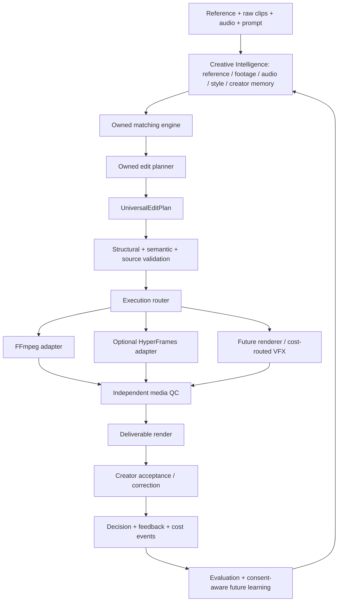

# Architecture

Phase 1 implementation note: the local reference analyzer now lives in `packages/reference-analyzer`, with narrow Python primitives and local process/filesystem adapters under `python/reference_analyzer` and `scripts`. See [the implemented boundary](reference-analyzer.md) and [reference-only 1.1.0 evolution](reference-contract-v11.md). The Phase 0 foundation and deployment direction below remain intact; later-phase provider descriptions are design seams, not implemented services.

## Product boundary

The first product is an autonomous editor for 15–30 second vertical creator Reels. Creators supply their own clips, optionally a reference, audio, and an instruction. The system owns selection, timing, planning, execution, and revisions. Manual corrections are product feedback; they should not require creators to learn an editing timeline.

The initial commercial constraint is approximately ₹100 revenue per STANDARD Reel. That is a target, not a demonstrated margin. Compute, retries, storage, and failed/rejected attempts must be observable before selecting production models or renderer tiers.

## Frozen direction

V0 uses pretrained systems and deterministic methods as later phases require. No custom model training is implemented. No provider SDK, vendor output object, shell command, filter graph, or editor project format belongs in a core edit plan.

## Modules and dependency direction

| Module | Responsibility | Dependency boundary |
| --- | --- | --- |
| contracts | Versioned structural and local semantic schemas | Zod and shared contract primitives |
| domain | Types inferred from schemas; canonical serialization | Type-only schema dependency; no provider SDK |
| validation | Source/decision joins, plan digest, independent QC seam | Contracts and domain |
| providers | Ports and the synthetic dry-run execution adapter | Owned domain contracts; adapter may call validation |
| telemetry | Event validation, idempotency, snapshots, provenance | Contracts and domain; no media storage |
| jobs | Allowed transitions, optimistic version, failure/retry rules | Domain and contracts; no queue implementation |
| evaluation | Explicit metrics, frozen benchmark integrity | Owned events/contracts; no training loop |
| samples | Local composition root | Wires fixtures and modules without infrastructure |

One private npm project and one strict TypeScript build avoid unnecessary workspace tooling. `apps/web`, API, and Python worker directories are intentionally deferred because README-only applications add no executable Phase 0 value. This is a modular monolith foundation, with separable worker entry points later.

## Decisions and reasons

| Decision | Reason and evidence |
| --- | --- |
| Executable schemas are the source of truth | Inferred TypeScript types prevent schema/type drift. Tests validate all 12 requested contracts plus `MediaAsset`; generated schemas support later Python interchange. |
| Two validation levels | JSON Schema cannot express every timing or reference join. Local refinements and `validatePlanWithInputs` reject source bounds, ownership scope mismatches, missing decisions, and unavailable media. |
| Versioned owned outputs | Analyzer or SDK replacement preserves consumer shapes. Contract doubles demonstrate two vision identities and two independently implemented renderers using the same consumer code. This proves interface substitution, not equal model quality. |
| Rational fps, seconds for source/timeline ranges | Rational frame rate preserves values such as 30000/1001. V1 timing uses finite seconds and an explicit 1 μs comparison tolerance; real frame/sample rounding belongs in the execution adapter and QC policy. |
| Integer INR microrupees | Event ledgers avoid floating-point billing accumulation. Evaluation sums with integers and labels synthetic/estimated/measured evidence. |
| Independent QC | Renderer success only supplies a receipt and object reference. Required QC checks, active plan/render identity, and media receipt kind gate delivery. Dry-run receipts cannot be promoted. |
| Explicit state version | Queue delivery may repeat and timestamps may collide. A monotonic `stateVersion` supports optimistic compare-and-set independently of edit revision and retry attempt. |
| Separate event and media ownership | Stable IDs let learning records outlive a media object when policy permits; they do not require permanent video retention. Deletion still applies to identifiable derived data. |
| No infrastructure yet | Every Phase 0 requirement can be exercised locally. No durable queue, database, object bucket, server, or provider account is needed to test the contracts. |

## Analysis and execution boundaries

Phase 2 adds a reference-independent footage pipeline alongside the reference analyzer. Coarse shots feed a bounded cheap OpenCV lattice; a separate event selector chooses a smaller semantic lattice. The shared SigLIP/cache implementation embeds unique selected images once. Candidate proposal and aggregation consume reusable features without a provider call. A TypeScript ClipSegment builder retains the frozen contract, with technical measurements and full candidate/feature/version lineage in validated sidecars. Coverage is measured before conservative pruning. See [the footage architecture and limits](footage-analyzer.md).

Adapters must translate external responses into owned schemas before returning them. The Phase 1 Python worker emits narrow versioned JSON; TypeScript constructs the reference fingerprint and runs its semantic validator before persistence. Exported JSON Schemas alone are not sufficient validation. Shared Python/TypeScript interchange tests accompany the worker; Python does not duplicate the full domain model.

`VisionProvider`, `VideoEmbeddingProvider`, `MotionProvider`, `SpeechProvider`, `AudioAnalysisProvider`, and `LLMProvider` are interfaces. Their model provenance uses `ModelRun`. The Phase 1 local reference embedding implementation uses the defaulted generic VideoEmbeddingProvider seam; other live-provider implementations remain deferred. LLM outputs are limited to future analysis/plan proposals; models do not author trusted job state or billing events. Speech text stays in the user-content path.

An embedding reference names an immutable space, version, dimensions, metric, and stored object. The matcher can consume the reference shape across provider changes. Vectors from different spaces must not be compared; a migration requires re-embedding or separate indexes plus benchmark evaluation. `assertCompatibleEmbeddingSpaces` enforces the comparison precondition.

`Renderer.render(plan)` receives only a `UniversalEditPlan`. Adapter context supplies the job/render identity, injected clock, and eventually object resolution. `DryRunRenderer` validates the plan and creates a SHA-256-bound synthetic receipt. It never resolves files or assembles commands. A future FFmpeg adapter must construct allowlisted argument arrays, validate capabilities, and report unsupported features explicitly. No model-generated shell commands are permitted.

Standard edits should prefer deterministic FFmpeg execution, with optional graphics through an interchangeable adapter. HyperFrames, OpenCut, and future VFX remain replaceable. Expensive generative/VFX routes need explicit capability, quality, and cost policy; no router or advanced route is implemented in Phase 0.

## Job lifecycle

The schema includes all requested states: `UPLOADED`, `ANALYZING_REFERENCE`, `ANALYZING_FOOTAGE`, `ANALYZING_AUDIO`, `MATCHING`, `PLANNING`, `RENDERING_PREVIEW`, `QC`, `PREVIEW_READY`, `REVISION_REQUESTED`, `RENDERING_FINAL`, `COMPLETE`, `FAILED`.

Reference and audio analysis may be skipped when absent. Preview and final rendering both go through QC. QC completion targets the stored preview/final intent. A revision increments the edit revision and clears the old active plan/render. Final rendering uses the plan that passed preview QC. `failJob` requires the current stage, a sanitized error code/message, retryability, and a timestamp. `retryJob` resumes that stage and increments the attempt and state version; it cannot silently restart an unrelated stage.

Later queue implementations must provide leases/renewal, retry scheduling, deduplication, and acknowledgements after durable state/event writes. Later repositories must atomically compare `stateVersion`, not timestamps. Use a transactional outbox when crossing database/queue boundaries. Exactly-once execution is not assumed; operation/event identities and idempotent sinks handle repeated delivery.

## Independent QC seam

The required checks are plan binding, planned timing, non-zero file, media duration, frame count, codec, resolution, audio presence, black-frame duration, and A/V synchronization. Measurements are typed by unit. Observed values are mandatory for passing checks; unchecked tests cannot claim observations. Policy thresholds/tolerances are versioned separately.

`inspectPlanReceipt` performs plan binding and planned timing checks only. All media checks are `not_checked`, so its result is `incomplete`, with `deliveryAllowed: false`. Actual object probing/decoding and media quality policy are Phase 6 work. Schemas establish evidence shape; a trusted independent QC worker must establish evidence truth. Contract-test media receipts and QC values are explicitly synthetic and are never presented as successful customer rendering.

## Future deployment, without premature services

The intended shape is web + API + PostgreSQL + object storage + a queue + analysis/render workers. TypeScript owns orchestration, telemetry, state, and plans. Phase 1 uses Python for narrow local video/ML primitives; production worker deployment remains a future decision. Workers can scale independently when measured workloads justify it. No Kubernetes, Kafka, service mesh, cloud resources, database, queue, or web framework is introduced here.
